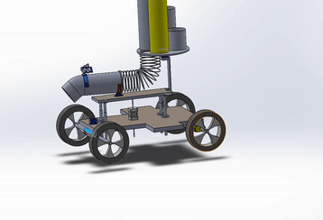
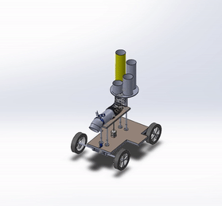
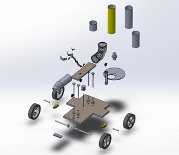
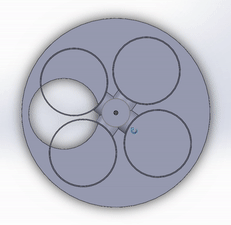

# WARMAN 2020 Competition

This repository contains the information about our final product for the WARMAN 2020 competition, with 2 months of build from scratch, through a variety of processes.

* Full report: See [Report PDF File](Warman%202020%20Full%20Report.pdf)
* Operation Arduino code: See [Full code file](warman2020.ino)
* Presentation: See [PowerPoint file](Presentation.pptx)

  
   How the device operate its functionalities.

  
   Disassembly of the device.

  
   Assembly of the device.

  
   How the device control which tube to operate, using an encoding plate.

